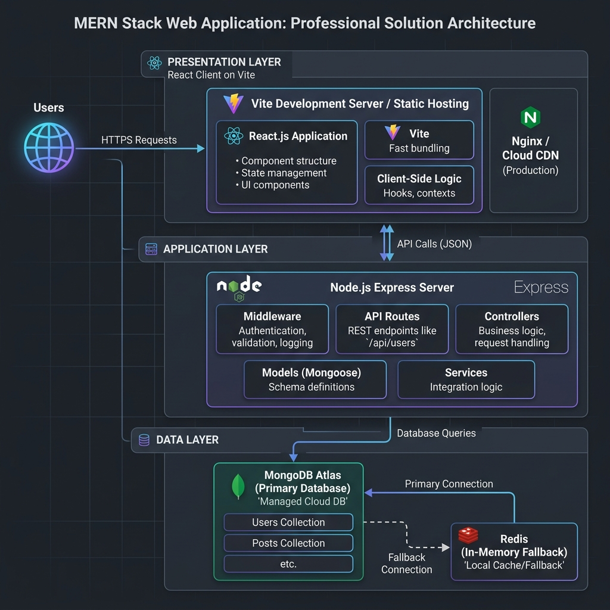

# Solution Architecture

| Field | Detail |
| :--- | :--- |
| **Date** | 18th June 2026 |
| **Team ID** |  |
| **Project Name** | ShopEZ Stocks - MERN Stock Trading Simulator |
| **Developed by** | Gunturu Sai Teja |
| **Role** | Lead Developer and Systems Architect |

---

## What is a Solution Architecture?

Solution Architecture is a structural design that defines how all components of a software system interact to meet both functional and non-functional requirements. It describes the technology layers, data flows, external interfaces, and deployment infrastructure that power the application.

## Four Core Architecture Goals

* **Find the Best Technology Solution**: We evaluated multiple stacks and selected MERN (MongoDB, Express, React, Node.js) for its JavaScript-unified codebase, massive community support, and natural alignment with high-frequency JSON-based data exchange.
* **Describe Structure and Behavior to Stakeholders**: Our architecture is divided into three clear tiers - Presentation (React frontend on Vite/local host), Application (Node/Express API backend), and Data Layer (MongoDB Atlas with In-Memory fallback).
* **Define Features and Requirements**: The architecture enforces strict role-based access control - the React router guards protected pages on the frontend, while Express middleware validates JWT Bearer tokens on protected API endpoints on the backend.
* **Provide Delivery Specifications**: The frontend is delivered as a static Vite build served locally or from a CDN. The backend runs as a continuous Node service executing Express routers and hosting a background market simulator. Environment variables manage all sensitive credentials.

## Solution Architecture Diagram

## Architecture Component Breakdown

| Layer | Technology | Responsibility |
| :--- | :--- | :--- |
| Presentation Layer | React.js (Vite) | Renders the UI, manages component state, handles routing via React Router, and renders graphs using Chart.js. |
| State Management | React Context API | Provides global authentication status and trader cash balance tracking across all pages. |
| HTTP Communication | Axios | Sends asynchronous API requests from frontend to backend with credentials using JWT Bearer headers. |
| Application Layer | Node.js + Express.js | Exposes RESTful API endpoints, validates requests, applies trading logic, and drives the background stock simulator. |
| Authentication | JWT + bcryptjs | Signs tokens, hashes passwords, and validates sessions via Bearer token request headers. |
| Database ORM | Mongoose | Enforces schema validation and provides query abstraction over MongoDB. |
| Database | MongoDB Atlas / memStore | Stores users, stock quotes, holdings, and transaction logs. Falls back to an in-memory store if MongoDB is down. |
| Hosting (Frontend) | Vite / Vercel | Serves the compiled React static files globally or locally with zero configuration. |
| Hosting (Backend) | Express / Vercel | Executes Express API and starts the stock simulation engine loop (updates every 6 seconds). |
