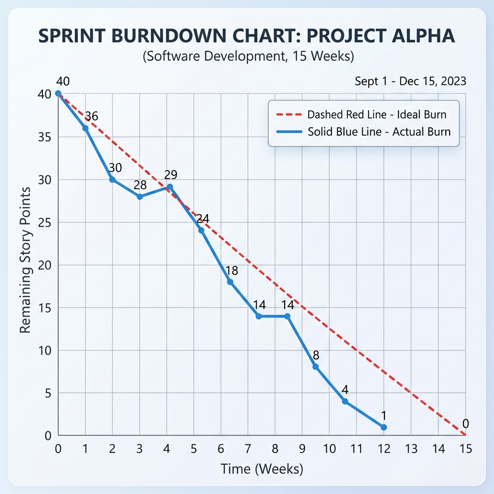

# Project Planning Template

| Field | Detail |
| :--- | :--- |
| **Date** | 18th June 2026 |
| **Team ID** |  |
| **Project Name** | ShopEZ Stocks - MERN Stock Trading Simulator |
| **Developed by** | Gunturu Sai Teja |
| **Role** | Lead Developer and Systems Architect |

---

## Product Backlog & Sprint Schedule

| Sprint | Functional Requirement (Epic) | User Story No. | User Story / Task | Story Points | Priority | Team Member |
| :--- | :--- | :--- | :--- | :--- | :--- | :--- |
| Sprint 1 | Authentication | USN-1 | As a trader, I want to register with username, email, and password so I can open a simulator account. | 3 | High | Sai Teja |
| Sprint 1 | Authentication | USN-2 | As a trader, I want to log in securely using JWT and receive a token so my session is protected. | 3 | High | Sai Teja |
| Sprint 1 | Stock Explorer | USN-3 | As a trader, I want to view all simulated stock quotes with live-updating prices so I can select stocks to buy/sell. | 5 | High | Sai Teja |
| Sprint 1 | Stock Explorer | USN-4 | As a trader, I want to search and filter stocks by ticker symbol so I can find specific companies easily. | 3 | High | Sai Teja |
| Sprint 2 | Order Execution | USN-5 | As a trader, I want to place BUY and SELL orders for shares so I can build my portfolio and adjust my cash balance. | 5 | High | Sai Teja |
| Sprint 2 | Stock Detail Chart | USN-6 | As a trader, I want to view detailed price history and interactive charts for a stock so I can make informed trades. | 5 | High | Sai Teja |
| Sprint 2 | Portfolio Management | USN-7 | As a trader, I want to view my investments, average buy prices, current value, and net profit/loss so I can track my performance. | 5 | Medium | Sai Teja |
| Sprint 3 | Admin Panel | USN-8 | As an admin, I want to manage stock listings, view trader logs, and rollback transactions so I can moderate the simulator platform. | 5 | Medium | Sai Teja |
| Sprint 3 | Deployment | USN-9 | As a developer, I want to deploy the frontend and backend to Vercel/Render with database connection fallback so the app is online. | 3 | High | Sai Teja |

## Project Tracker Velocity & Burndown Chart

| Sprint | Total Story Points | Duration | Sprint Start Date | Sprint End Date | Story Points Completed | Sprint Release Date |
| :--- | :--- | :--- | :--- | :--- | :--- | :--- |
| Sprint 1 | 14 | 5 weeks | 11 May 2026 | 18 June 2026 | 14 | 18 June 2026 |
| Sprint 2 | 15 | 5 weeks | 11 May 2026 | 18 June 2026 | 15 | 18 June 2026 |
| Sprint 3 | 8 | 5 weeks | 11 May 2026 | 18 June 2026 | 8 | 08 June 2026 |

Team Velocity: Average story points completed per sprint = (14 + 15 + 8) / 3 = 12.3 story points/sprint.

Burndown Chart: The burndown chart for ShopEZ Stocks plotted the total remaining story points against the sprint calendar. In Sprint 1, we completed all 14 planned points, producing a steady downward burn. Sprint 2 maintained momentum completing all 15 points. Sprint 3 closed out the remaining 8 points, resulting in a clean burndown to zero by the final release date.

